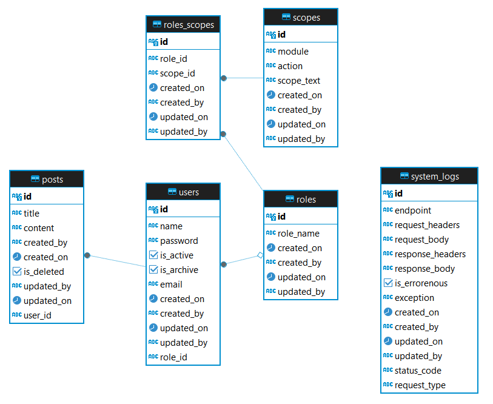

# Blog Platform Backend - Setup Instructions

Follow these steps to set up the project locally:

## 1. Open a New Folder

## 2. Clone the Repository
```bash
git clone https://github.com/himanshu-0611/blog-platform-backend.git -b dev
```

## 3. Move to Root Directory
```bash
cd blog-platform-backend
```

## 4. Install Dependencies
```bash
npm install
```

## 5. Environment Setup
- Paste the `.env` file in the project root (sibling of `package.json`).
- Update PostgreSQL username, password, and other credentials if needed as per your local Postgres Server.

## 6. Generate Prisma Client
```bash
npx prisma generate
```

## 7. Run Migrations
```bash
npx prisma migrate dev
```

## 8. Seed Database
```bash
npm run seed
```

## 9. Start Development Server
```bash
npm run start:dev
```

## 10. Test the API
- This is a seeded user in DB during initilization.
```bash
curl --location 'http://localhost:3000/blog-platform-be/v1/auth/login' \
--header 'Content-Type: application/json' \
--data-raw '{

  "email": "superuser@gmail.com",
  "password": "123456"
}'
```

## 11. Business Logic
- ER Diagram: 
- We have 2 roles seeded in roles table: Member and Super User.
- 1 user with role Super User is seeded in the DB with mail id superuser@gmail.com and password '123456'.
- Super User has additional features for deleting any Member, deleting posts of any Member, as per the requirements document.
- New Sign Up by default creates user with Member role, Super User can promote or demote the new user to and from Super User role respectively.
- Member has limited features like deleting only their own posts.
  - But all these features are dynamic — if we want to allow Members to delete posts of other users, we can do so without changing backend code.
  - If we want to remove the ability for Super Users to delete the posts of others, we can do so without backend code changes.
  - This is made possible by user roles/scopes being assigned from the DB and not hardcoding roles for specific APIs.
- Sign Up new users to create users with Member roles.
- Posts are server side paginated, with search capability on title or content.
- All users can currently be fetched only by Super User.
  - This feature can also be given to Member role, without any backend deployent needed.
- UUID is used as PK in tables to avoid security vulnerabilities because of using auto incremented ids.
- system_logs table stores logs of all the request/response being processed by the system.
---
